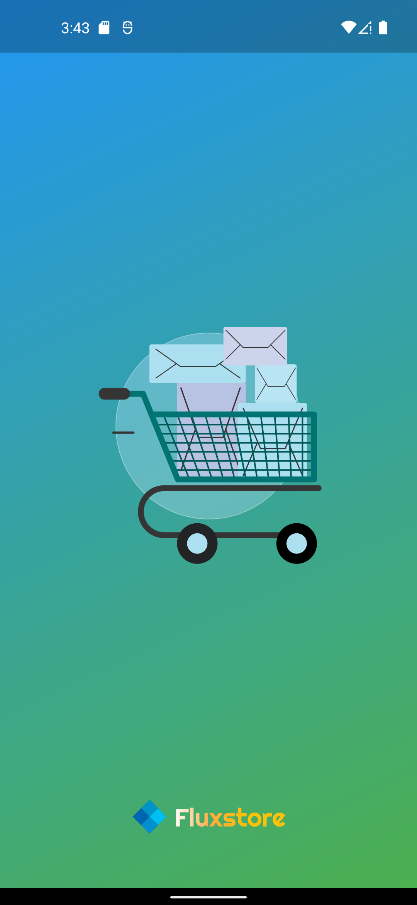
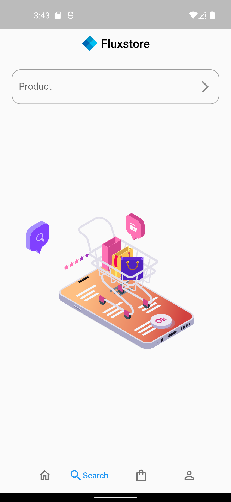
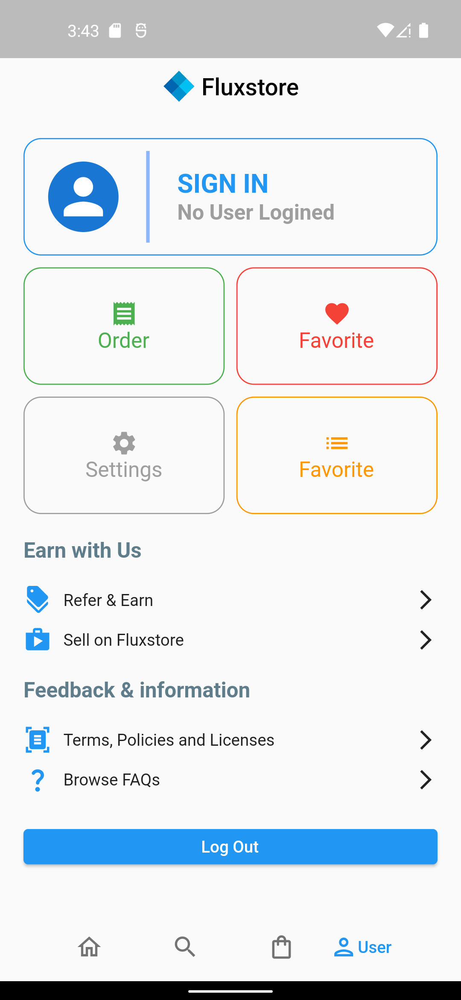

<p align="center">

<h1 align="center"> Fluxstore </h1>
<h3 align="center"> Top destination for all for online shopping needs.</h3>

<br>
<p align="center">
<a href="https://github.com/subrotokumar/fluxstore-shopping-ui/releases">  </a>
<br>
<a href="https://github.com/subrotokumar/fluxstore-shopping-ui" alt="GitHub release"></a>
</p>


## Preview
<p align="center">






</p>

## Features
- Clean and Stunning UI
- Sharing option: Allow you to share info via the platform sharing UI
- Available for both Android and IOS
## Technology Used
- Programming Language: **Dart**
- UI Framework: **Flutter**
    
## Created By 
Auther: [Subroto Kumar](https://bio.link/subroto)

## Getting Started

You can build and run this by following these steps:

```bash
git clone https://github.com/subrotokumar/fluxstore-shopping-ui.git
cd fluxstore-shopping-ui
flutter run
```

## Contribution
Your ideas, translations, design changes, code cleaning, or real heavy code changes or any help is always welcome. The more is contribution the better it gets

[Pull requests](https://github.com/fluxstore-shopping-ui/pulls) will be reviewed
<!--
#### Known issues and limitations
-->
<h3 align="center">**Star :star:  this repo to show your support and it really does matter!** :clap:</h4>